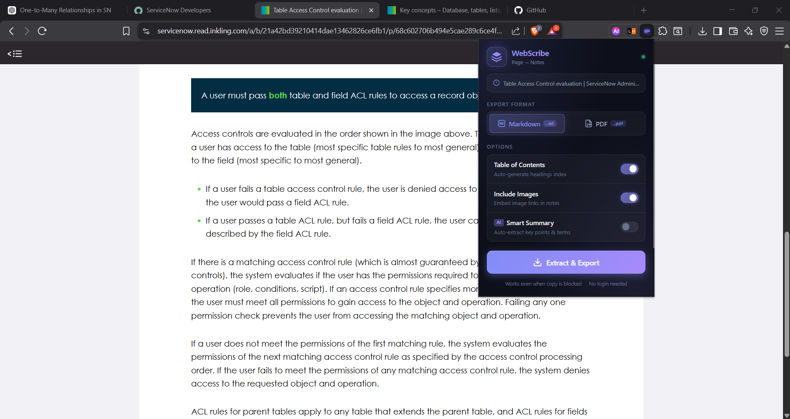
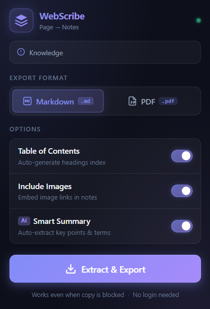
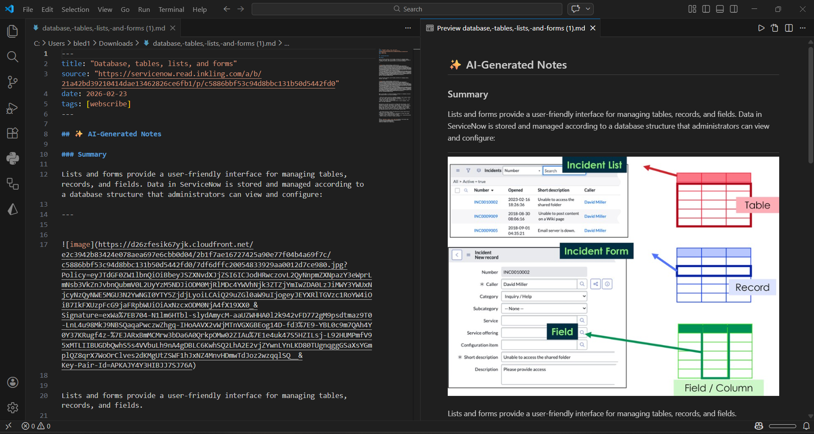
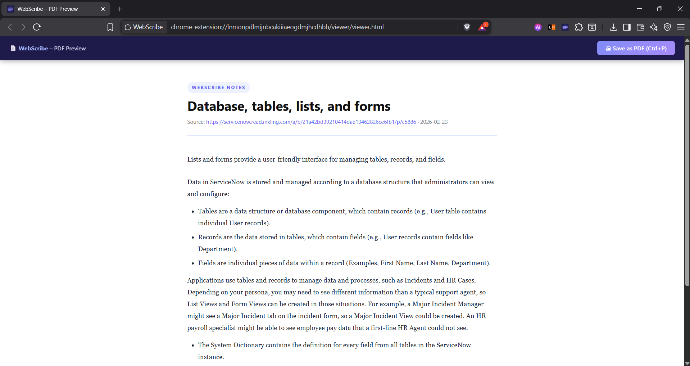

<div align="center">


# WebScribe

**Convert any webpage into clean, structured notes — one click, completely offline.**

[](https://developer.chrome.com/docs/extensions/mv3/)
[](LICENSE)
[](manifest.json)
[](#privacy)

**Works even when copy is blocked · No login · No API key · No cloud**

---

[Features](#features) · [Screenshots](#screenshots) · [How It Works](#how-it-works) · [Installation](#installation) · [Architecture](#architecture) · [Roadmap](#roadmap) · [Contributing](#contributing)

</div>

---

## What Is WebScribe?

WebScribe is a Chrome extension that extracts the readable content from **any webpage** — including pages that block copy-paste — and exports it as a clean **Markdown file** or a styled **PDF**. It was built for students, developers, and researchers who need to save information without fighting with copy restrictions, messy print outputs, or scattered notes.

> **The key insight:** Copy restrictions prevent clipboard access, not DOM access. WebScribe reads the page's rendered DOM directly — exactly what you see in Chrome DevTools → Elements — making copy restrictions irrelevant.

---

## Screenshots

### Popup UI in action on a copy-restricted page (ServiceNow / Inkling)



> The extension works on `servicenow.read.inkling.com` — a platform that blocks right-click, text selection, and copy-paste. WebScribe extracts the full chapter content directly from the live DOM.

---

### The popup



A dark glassmorphism design with format selector, options toggles, and a one-click export button. The green dot confirms the extension is active and connected to the current tab.

---

### Markdown export — VS Code preview



The exported `.md` file includes:
- **YAML frontmatter** (`title`, `source`, `date`, `tags`) — ready for Obsidian or any note app
- **✨ AI-Generated Notes** — auto-extracted summary, key points, and term definitions (no API key)
- **Table of Contents** — auto-linked from all headings
- Full article content with headings, lists, code blocks, tables, and image links

---

### PDF export — styled preview page



The PDF viewer opens as a dedicated tab (`chrome-extension://…/viewer/viewer.html`) with a styled, print-ready layout. Press **Ctrl+P → Save as PDF** to get a clean, selectable-text PDF — no canvas rendering, no image PDFs.

---

## Features

| Feature | Details |
|---|---|
| 🔓 **Bypass copy restrictions** | Reads `innerText` from the live DOM — unaffected by `user-select:none` or clipboard event blockers |
| 📄 **Markdown export** | Clean `.md` with YAML frontmatter, TOC, and Obsidian-compatible formatting |
| 🖨 **PDF export** | Styled print-ready HTML → browser native print → selectable-text PDF |
| ✨ **Local AI notes** | Summary, key points, and glossary terms extracted with local heuristics — no API key |
| 🪟 **iframe support** | Injects into all frames (`allFrames: true`) — captures content inside embedded iframes |
| 📦 **Fully offline** | Mozilla Readability.js bundled locally; no network calls for core features |
| 🔒 **Privacy first** | All processing runs in your browser; no data leaves the device |
| ⚡ **No build step** | Pure vanilla JavaScript — just load the folder as an unpacked extension |

---

## How It Works

```
Browser Tab (any page)
        │
        ▼
  content/content.js  ←── injected into all frames (allFrames: true)
        │
        │  1. Scores DOM containers by text density
        │  2. Walks live document.body — same as DevTools Elements
        │  3. Visibility-aware (respects getComputedStyle)
        │  4. Falls back to Mozilla Readability, then innerText
        │
        ▼
  Structured Content Model
  { metadata, nodes: [ {type, text}, … ] }
        │
        ├──── Markdown ──► MarkdownGenerator → .md download
        │
        └──── PDF ────────► chrome.storage.local
                                    │
                                    ▼
                            viewer/viewer.html  (new tab)
                            renders styled HTML → Ctrl+P → PDF
```

### Extraction strategies (in priority order)

1. **Smart container scoring** — scans all `div / section / article / main` elements, scores by text density (total text minus link text + structural elements). Picks the richest non-nav container.
2. **Mozilla Readability** — used as an enhancement when structured walk finds fewer than 3 nodes.
3. **`innerText` split** — splits `document.body.innerText` on double newlines. Always succeeds.

---

## Installation

> WebScribe is not yet on the Chrome Web Store. Install it as an unpacked extension in developer mode:

### 1. Clone or download

```bash
git clone https://github.com/your-username/WebScribe.git
# — or — download the ZIP and extract it
```

### 2. Open Chrome Extensions

Navigate to `chrome://extensions/` in your browser.

### 3. Enable Developer Mode

Toggle **Developer mode** in the top-right corner of the extensions page.

### 4. Load unpacked

Click **Load unpacked** → select the `WebScribe` folder (the one containing `manifest.json`).

### 5. Use it

Navigate to any webpage, click the **WebScribe** icon in the toolbar, choose your format, and click **Extract & Export**.

> **Tip:** Pin the extension to the toolbar so it's always one click away: Extensions menu (puzzle icon) → pin WebScribe.

---

## Project Structure

```
WebScribe/
├── manifest.json              # Chrome MV3 manifest
│
├── popup/
│   ├── popup.html             # Extension popup shell
│   ├── popup.css              # Dark glassmorphism UI
│   └── popup.js               # Orchestrates extract → generate → export
│
├── content/
│   └── content.js             # Content script — live DOM extractor
│
├── lib/
│   ├── Readability.js         # Mozilla Readability (bundled, no CDN)
│   ├── markdown-generator.js  # Content model → Obsidian Markdown
│   ├── pdf-generator.js       # Legacy (reference only)
│   └── ai-assistant.js        # Local heuristic AI (no API key)
│
├── viewer/
│   ├── viewer.html            # PDF preview page (dedicated tab)
│   └── viewer.js              # Renders content from chrome.storage.local
│
├── background/
│   └── background.js          # MV3 service worker (message routing)
│
├── assets/
│   └── icon{16,32,48,128}.png # Extension icons
│
└── public/
    └── *.png                  # Screenshots used in README
```

---

## Architecture

### Content Security Policy (MV3)
All extension pages use `script-src 'self'` — no inline scripts, no `eval`. Every JS file is a separate, explicitly loaded module referenced by `src=""`.

### Why no build step?
All libraries (Readability.js) are bundled as plain JS files. No Webpack, Rollup, or TypeScript compilation required. This keeps the codebase auditable and easy to contribute to.

### Data flow for PDF
```
popup.js
  └─ chrome.storage.local.set({ webscribe_data })
  └─ chrome.tabs.create({ url: 'viewer/viewer.html' })
         └─ viewer.js (DOMContentLoaded)
               └─ chrome.storage.local.get('webscribe_data')
               └─ buildPageHTML(data) → page.innerHTML
               └─ chrome.storage.local.remove('webscribe_data')
```
Using `chrome.storage.local` + `chrome.tabs.create` instead of `window.open` ensures the viewer page stays alive independently of the popup lifecycle.

---

## Permissions

| Permission | Why it's needed |
|---|---|
| `activeTab` | Access the currently active tab |
| `scripting` | Inject content scripts into pages |
| `downloads` | Save Markdown files to disk |
| `tabs` | Read tab URL to detect chrome:// pages |
| `storage` | Pass extracted content to the PDF viewer tab |
| `webNavigation` | Enumerate all frames (`getAllFrames`) for iframe support |
| `host_permissions: <all_urls>` | Allow injection on any website |

No permissions are used for analytics, tracking, or remote data collection.

---

## Privacy

- ✅ All content processing is done **locally in your browser**
- ✅ No data is sent to any server
- ✅ The AI summary uses **local heuristics only** — no LLM API calls
- ✅ Exported files go directly to your Downloads folder
- ✅ `chrome.storage.local` data is cleared immediately after the PDF viewer renders

---

## Roadmap

### Phase 2 — Integrations
- [ ] **Obsidian vault save** — native messaging companion to write directly to a vault
- [ ] **LLM-powered AI** — optional OpenAI / Gemini API key for richer summaries
- [ ] **Custom templates** — user-defined Markdown/PDF templates
- [ ] **Batch export** — export multiple open tabs at once
- [ ] **Highlight mode** — select text on page, extract only the selection

### Phase 3 — Platform
- [ ] Chrome Web Store release
- [ ] Firefox / Edge port
- [ ] Notes app integrations (Notion, Roam, Logseq)

---

## Contributing

Contributions are welcome! The codebase is intentionally small and has no build step — you can start contributing within minutes.

```bash
git clone https://github.com/your-username/WebScribe.git
# Edit files directly — no npm install, no build needed
# Load the folder as an unpacked extension to test
```

### Areas that need help
- **Site-specific extractors** — some platforms need custom selectors (open an issue with the URL)
- **PDF styling** — improve print CSS for edge cases
- **Firefox port** — adapt `chrome.*` calls to `browser.*` with polyfill
- **Tests** — add unit tests for `markdown-generator.js` and `ai-assistant.js`

Please open an issue before submitting a large PR so we can align on approach.

---

## License

MIT — see [LICENSE](LICENSE).

---

<div align="center">

Built with ☕ and frustration at copy-restricted textbook platforms.

**Star ⭐ if WebScribe saved you time.**

</div>
